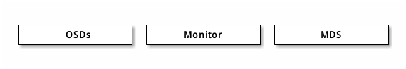
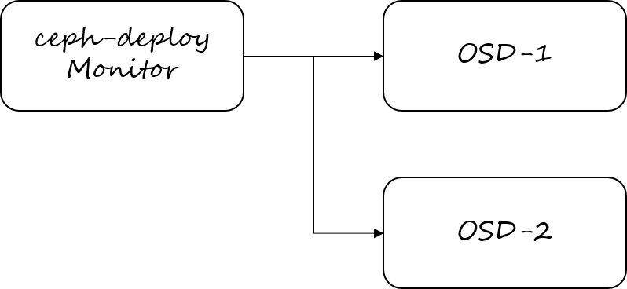

在CentOS7.3上部署 Ceph 存储集群
=============================

不管你是想为云平台提供Ceph 对象存储和/或 Ceph 块设备，还是想部署一个 Ceph 文件系统或者把 Ceph 作为他用，所有 Ceph 存储集群的部署都始于部署一个个 Ceph 节点、网络和 Ceph 存储集群。 Ceph 存储集群至少需要一个 Ceph Monitor 和两个 OSD 守护进程。而运行 Ceph 文件系统客户端时，则必须要有元数据服务器（ Metadata Server ）。



* OSD: Ceph OSD 守护进程（ Ceph OSD ）的功能是存储数据，处理数据的复制、恢复、回填、再均衡，并通过检查其他OSD 守护进程的心跳来向 Ceph Monitors 提供一些监控信息。当 Ceph 存储集群设定为有2个副本时，至少需要2个 OSD 守护进程，集群才能达到 `active+clean` 状态（ Ceph 默认有3个副本，但你可以调整副本数）。
* Mon: Ceph Monitor维护着展示集群状态的各种图表，包括监视器图、 OSD 图、归置组（ PG ）图、和 CRUSH 图。 Ceph 保存着发生在Monitors 、 OSD 和 PG上的每一次状态变更的历史信息（称为 epoch ）。
* MDS: Ceph 元数据服务器（ MDS ）为 Ceph 文件系统存储元数据（也就是说，Ceph 块设备和 Ceph 对象存储不使用MDS ）。元数据服务器使得 POSIX 文件系统的用户们，可以在不对 Ceph 存储集群造成负担的前提下，执行诸如 ls、find 等基本命令。

Ceph 把客户端数据保存为存储池内的对象。通过使用 CRUSH 算法， Ceph 可以计算出哪个归置组（PG）应该持有指定的对象(Object)，然后进一步计算出哪个 OSD 守护进程持有该归置组。 CRUSH 算法使得 Ceph 存储集群能够动态地伸缩、再均衡和修复。

# 一、预检

在部署 Ceph 存储集群之前，需要对 Ceph 客户端和 Ceph 节点进行一些基本的配置。

Ceph 要求必须是奇数个监控节点，而且最少3个（自己玩玩的话，1个也是可以的），ceph-adm 是可选的，可以把 ceph-adm 放在 monitor 上，只不过把 ceph-adm 单独拿出来架构上看更清晰一些。当然也可以把 mon 放在 osd 上，生产环境下是不推荐这样做的。

## 1.1 确保联通性

在三台服务器上设置hosts文件
```
echo '172.18.26.21 test1'   >> /etc/hosts
echo '172.18.26.22 test2'   >> /etc/hosts
echo '172.18.26.23 test3'   >> /etc/hosts
cat /etc/hosts
```

## 1.2 关闭防火墙
```
systemctl stop firewalld.service
systemctl disable firewalld.service
```

## 1.3 允许无密码 SSH 登录

因为 ceph-deploy 不支持输入密码，你必须在管理节点上生成 SSH 密钥并把其公钥分发到各 Ceph 节点。 ceph-deploy 会尝试给初始 monitors 生成 SSH 密钥对。

 生成 SSH 密钥对，但不要用 sudo 或 root 用户。提示 “Enter passphrase” 时，直接回车，口令即为空。

```
ssh-keygen

Generating public/private key pair.
Enter file in which to save the key (/ceph-admin/.ssh/id_rsa):
Enter passphrase (empty for no passphrase):
Enter same passphrase again:
Your identification has been saved in /ceph-admin/.ssh/id_rsa.
Your public key has been saved in /ceph-admin/.ssh/id_rsa.pub.
```

把公钥拷贝到各 Ceph 节点。
```
ssh-copy-id root@test1
ssh-copy-id root@test2
ssh-copy-id root@test3
```

## 1.4 安装 Ceph 部署工具

把 Ceph 仓库添加到 ceph-deploy 管理节点，然后安装 ceph-deploy 。

### 1.4.1 添加epel-release源
```
mv /etc/yum.repos.d/epel.repo /etc/yum.repos.d/epel.repo.backup
mv /etc/yum.repos.d/epel-testing.repo /etc/yum.repos.d/epel-testing.repo.backup
wget -O /etc/yum.repos.d/epel.repo http://mirrors.aliyun.com/repo/epel-7.repo
```

### 1.4.2 添加ceph源
```
rpm --import 'http://mirrors.163.com/ceph/keys/release.asc'
```

```
cat > /etc/yum.repos.d/ceph.repo << EOF  
[ceph]
name=Ceph packages for x86_64
baseurl=http://mirrors.163.com/ceph/rpm-kraken/el7/x86_64
enabled=1
priority=1
gpgcheck=1
type=rpm-md
gpgkey=http://mirrors.163.com/ceph/keys/release.asc

[ceph-noarch]
name=Ceph noarch packages
baseurl=http://mirrors.163.com/ceph/rpm-kraken/el7/noarch
enabled=1
priority=1
gpgcheck=1
type=rpm-md
gpgkey=http://mirrors.163.com/ceph/keys/release.asc

[ceph-source]
name=Ceph source packages
baseurl=http://mirrors.163.com/ceph/rpm-kraken/el7/SRPMS
enabled=1
priority=1
gpgcheck=1
type=rpm-md
gpgkey=http://mirrors.163.com/ceph/keys/release.asc
EOF
```

### 1.4.3 更新软件库并安装 ceph-deploy
```
yum update && yum install ceph-deploy
```

# 二、存储集群快速入门

完成预检之后，你就可以开始部署 Ceph 存储集群了。

我们将准备了3台机器：
* 其中一台服务器做监控节点，同时还会部署管理工具
* 另外两台物理服务器都将做为存储节点



## 2.1 创建集群

为获得最佳体验，先在管理节点上创建一个目录，用于保存 ceph-deploy 生成的配置文件和密钥对。
```
mkdir my-cluster
cd my-cluster
```

如果在某些地方碰到麻烦，想从头再来，可以用下列命令清除配置：
```
ceph-deploy purge test1 test2 test3
ceph-deploy purgedata test1 test2 test3
ceph-deploy forgetkeys
```
> 通过测试发现，这并不好用，不如虚拟机快照。

### 2.1.1 初始化集群
```
ceph-deploy new test1
```
在当前目录下用 ls 和 cat 检查 ceph-deploy 的输出，应该有一个`ceph.conf`配置文件、一个`ceph.mon.keyring`monitor 密钥环和一个`ceph-deploy-ceph.log`日志文件。

### 2.1.2 修改配置文件
```
vi ceph.conf
```
添加以下内容
```
public network = 172.18.26.0/24
cluster network = 172.18.26.0/24
osd journal size = 10000
osd pool default size = 2
osd pool default min size = 1
osd pool default pg num = 1024
osd pool default pgp num = 1024
```

### 2.1.2 安装 Ceph
```
ceph-deploy install test1 test2 test3
```
ceph-deploy 将在各节点安装 Ceph 。

### 2.1.3 配置初始 monitor(s),并收集所有密钥
```
ceph-deploy mon create-initial
```
完成上述操作后，当前目录里应该会出现这些密钥环：
* ceph.client.admin.keyring
* ceph.bootstrap-osd.keyring
* ceph.bootstrap-mds.keyring
* ceph.bootstrap-rgw.keyring

### 2.1.4 配置OSD
分别在三台服务器上初始化如下目录
```
mkdir -p /var/lib/ceph/osd/ceph-1
chmod 777 -R /var/lib/ceph/osd/ceph-1

mkdir -p /var/lib/ceph/osd/ceph-2
chmod 777 -R /var/lib/ceph/osd/ceph-2
```
然后，从管理节点执行 ceph-deploy 来准备 OSD
```
ceph-deploy osd prepare test2:/var/lib/ceph/osd/ceph-1 test3:/var/lib/ceph/osd/ceph-2 
```
最后，激活 OSD
```
ceph-deploy osd activate test2:/var/lib/ceph/osd/ceph-1 test3:/var/lib/ceph/osd/ceph-2 
```

### 2.1.5 分发密钥
```
ceph-deploy admin test1 test2 test3
```
用 ceph-deploy 把配置文件和 admin 密钥拷贝到所有节点，这样你每次执行 Ceph 命令行时就无需指定 monitor 地址和 ceph.client.admin.keyring 了。

### 2.1.6 检查集群的健康状况
```
$ ceph health
HEALTH_OK
$ ceph -s
cluster 46e47d7f-36ed-47e1-94fc-bfec8555b978
    health HEALTH_OK
    monmap e2: 1 mons at {test1=172.18.26.21:6789/0}
        election epoch 4, quorum 0 test1
    mgr active: test1 
    osdmap e10: 3 osds: 2 up, 2 in
        flags sortbitwise,require_jewel_osds,require_kraken_osds
    pgmap v72: 64 pgs, 1 pools, 0 bytes data, 0 objects
        22922 MB used, 217 GB / 239 GB avail
                64 active+clean
```
等 peering 完成后，集群应该达到 active + clean 状态。

## 2.2 操作集群

一个基本的集群启动并开始运行后，下一步就是扩展集群。在 node1 上添加一个 OSD 守护进程和一个元数据服务器。然后分别在 node2 和 node3 上添加 Ceph Monitor ，以形成 Monitors 的标准数量。